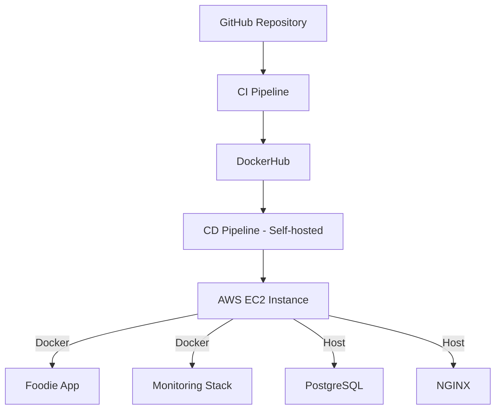
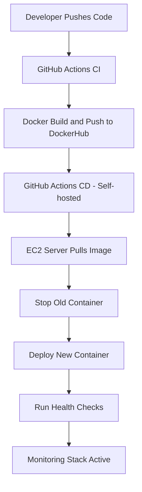
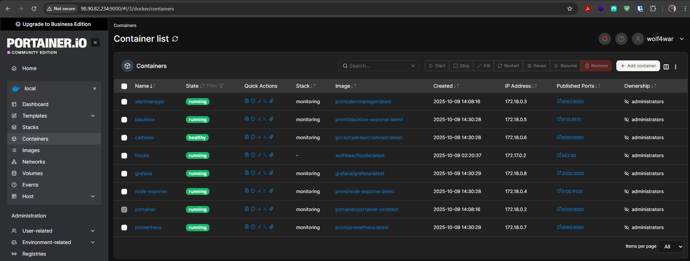

# 🍽️ Foodie - DevOps Implementation Project

A complete DevOps implementation showcasing Infrastructure as Code, CI/CD automation, containerization, and Site Reliability Engineering for a Vue.js recipe discovery application.

**Live Application:**
🔗 [http://98.90.82.234:443]

---

## 📋 Table of Contents

- Overview
- Architecture
- Version Control System
- Containerization with Docker
- Infrastructure as Code (Terraform)
- CI/CD Pipeline (GitHub Actions)
- Deployment to AWS EC2
- Monitoring and Observability
- Configuration Management (Ansible)
- Getting Started
- Challenges & Solutions
- Future Improvements
- Author

---

## 🎯 Overview

Foodie is a Vue.js-based recipe discovery application deployed on AWS EC2 using modern DevOps practices. It demonstrates a full automation pipeline from code commit → deployment → monitoring.


**Tech Stack:**
- **Frontend:** Vue.js 3, Vite, Tailwind CSS
- **Cloud:** AWS (EC2, VPC, EIP, Security Groups)
- **IaC:** Terraform
- **Containerization:** Docker & Docker Compose
- **CI/CD:** GitHub Actions (Self-hosted + GitHub-hosted runners)
- **Monitoring:** Prometheus, Grafana, Alertmanager, Node Exporter, cAdvisor, Blackbox, Portainer
- **Configuration:** Ansible

---

## 🏗️ Architecture



---

## 🧩 Version Control System

- Managed using Git and hosted on GitHub.
- Organized repository structure:

```
Foodie/
├── .github/workflows/
├── src/
├── ansible/
├── infrastructure/
├── monitoring/
├── Dockerfile
├── docker-compose.yml
└── nginx.conf
```

---

## 🐳 Containerization with Docker

- Multi-stage Docker build (Node build → Nginx runtime).
- Optimized final image (~50MB).
- Docker Compose manages full stack: app + monitoring tools.
- Container registry: `wolf4war/foodie`.

---

## 🏗️ Infrastructure as Code (Terraform)

- AWS EC2, VPC, Subnets, Security Groups, EIP.
- Automated provisioning via:
    ```bash
    terraform init
    terraform plan
    terraform apply
    ```
- User data automates Docker installation and server prep.

---

## 🔄 CI/CD Pipeline (GitHub Actions)

- **CI:** Build, lint, test, and Docker push.
- **CD:** Deploy to AWS EC2 via self-hosted runner.
- Secrets managed via GitHub Secrets.
- Health checks ensure zero failed deployments.

**Pipeline Flow (Mermaid):**


---

## ☁️ Deployment to AWS EC2

- Deployment handled through CD pipeline → Docker on EC2.
- Self-hosted GitHub Runner executes the deployment steps.
- Portainer provides container visibility:


---

## 🧠 Monitoring and Observability

**Stack Includes:**

| Tool              | Purpose                |
|-------------------|-----------------------|
| Prometheus        | Metrics collection    |
| Grafana           | Dashboards            |
| Alertmanager      | Alerts (email/webhook)|
| Node Exporter     | Host metrics          |
| cAdvisor          | Container metrics     |
| Blackbox Exporter | Endpoint checks       |
| Portainer         | Docker management     |

- Alerts configured: CPU, Memory, Disk, App health.
- Grafana dashboards: System, Containers, App metrics.
- Prometheus targets: All running services registered.

**Screenshots:**


---

## ⚙️ Configuration Management (Ansible)

Automates VM setup:
- Creates `devops` group.
- Installs PostgreSQL and Nginx.
- Copies `config.txt` to `/opt/` with correct permissions.

**Run the playbook:**
```bash
ansible-playbook -i inventory.ini foodie_setup.yml
```

---

## 🚀 Getting Started

**Local Setup:**
```bash
git clone https://github.com/Wolf4war/Foodie.git
cd Foodie
npm install
npm run dev
```

**Run with Docker Compose:**
```bash
docker-compose up -d
```

**Terraform + Ansible Deployment:**
```bash
cd infrastructure/terraform
terraform apply
cd ../../ansible
ansible-playbook -i inventory.ini foodie_setup.yml
```

---

## 🧩 Challenges & Solutions

- **SSH Key Permissions:** Resolved by copying key to WSL home and setting correct permissions.
- **Ansible Playbook Targeting:** Ensured inventory uses correct user and key path.
- **Docker Container Health:** Added health checks and resource limits for t2.micro.
- **Monitoring Integration:** Configured Prometheus and Grafana to auto-discover containers.

---

## 🔮 Future Improvements

- Add HTTPS via Let's Encrypt.
- Containerize PostgreSQL and link to app.
- Use S3 for Terraform state backend.
- Enable Slack alert integration.
- Migrate to ECS or Kubernetes for scaling.

---

## 👤 Author

Wolf4war

---

**Made with ❤️ — Foodie: Where recipes come to life!**
